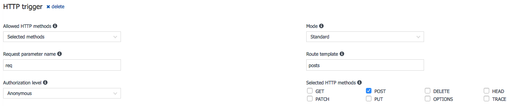
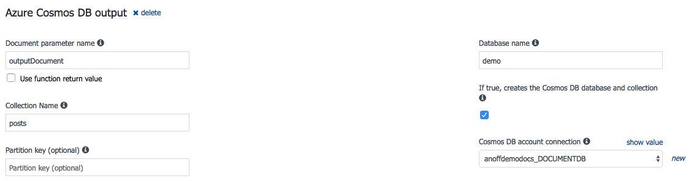
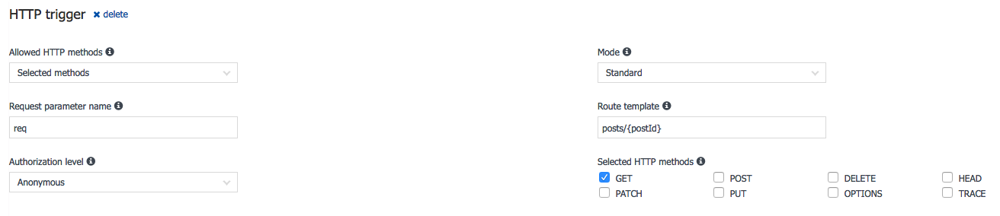
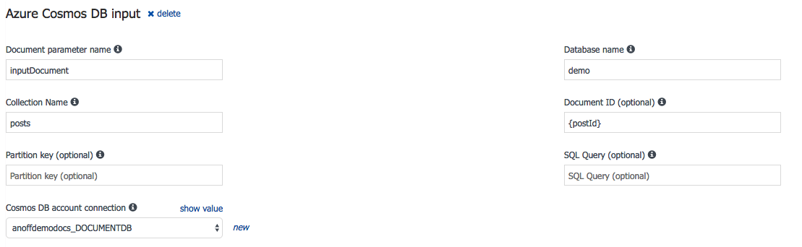

# Lookup for talk at @nodestuttgart
> Lookup stuff

## Resources:
* [functions-cli](https://www.npmjs.com/package/azure-functions-core-tools) (windows only 😑): CLI to help you develop locally & deploy
* [az-fn node reference](https://docs.microsoft.com/en-us/azure/azure-functions/functions-reference-node): how to write nodeJS code for functions
* [azure table storage](https://docs.microsoft.com/en-us/azure/storage/storage-nodejs-how-to-use-table-storage): How to use table storage
* [az-fn table storage bindings](https://docs.microsoft.com/en-us/azure/azure-functions/functions-bindings-storage-table): How to use table storage with functions
* [az-fn documentDB bindings](https://docs.microsoft.com/en-us/azure/azure-functions/functions-bindings-documentdb#using-a-documentdb-api-input-binding): Using documentDB (cosmosDB) with functions


## cheatsheet

### HTTP POST

```javascript
module.exports = function (context, req) {
    context.log('JavaScript HTTP trigger function processed a request.')

    if (req.body && req.body.title && req.body.content && req.body.author) {
        context.res = 'yarrrrr'
    }
    else {
        context.log(typeof req.body)
        context.res = {
            status: 400,
            body: "Please pass 'title', 'content' and 'author' in the body"
        }
    }

    context.done()
};
```

### HTTP POST w/ database write

```javascript
module.exports = function (context, req) {
    context.log('JavaScript HTTP trigger function processed a request.')

    if (req.body && req.body.title && req.body.content && req.body.author) {
        const id = '_' + Math.random().toString(36).substr(2, 9) // THIS IS NOT GOOD
        context.bindings.outputDocument = JSON.stringify({ 
            id,
            author: req.body.author,
            title: req.body.title,
            content: req.body.content,
            created_at: Date.now()
        })
        context.res = {
            status: 200,
            body: {id}
        }
    }
    else {
        context.log(typeof req.body)
        context.res = {
            status: 400,
            body: "Please pass 'title', 'content' and 'author' in the body"
        }
    }

    context.done()
}
```

`SETUP`




### HTTP GET w/ db IN

```javascript
module.exports = function (context, req) {
    context.log(`GET request for ${req.params.postId}`)
    context.res = {
        // status: 200, /* Defaults to 200 */
        body: context.bindings.inputDocument
    };
    context.done();
};
```

`SETUP`



